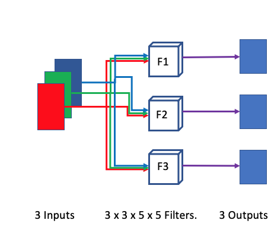
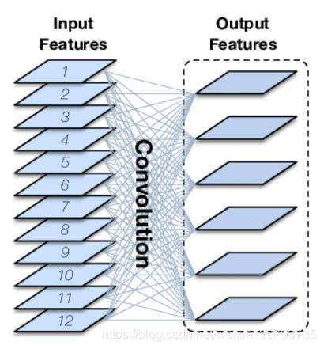
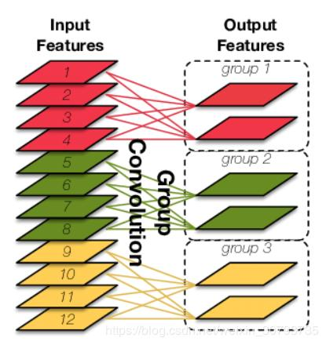

# Notes:

**Normal Convolution:**

Each convolution kernel CONVOLVES, while discretely moving, on the input using each channel of the input feature map and then result of each convolution kernel is the sum of the convolution results of each channel. (**Note:** here each channel of the feature map is related to all channels of the input feature map)







### Group convolutions:



One of the convolution layer’s parameters in PyTorch is the *groups* parameter. This parameter controls the connections between the input and output channels.

**Each channel of the output feature map of the packet convolution is only related to a part of the channel of the input feature map, and this part of the channel is a group**


#### Groups = 1

The default value, all input channels are convolved to all outputs.


#### Groups ≠ 1 and In_channels > Out_channels

If a `groups` value other than 1 is selected, the  value must be an integer such that the number of input channels and the number of output channels are both divisible by this number.

**A non-default groups value allows us to create multiple paths where each path connects only a subset of input channels to the output channels.**

As an example, suppose we have 8 channels coming out of an intermediate convolution layer and you want to convolve them in groups to produce four output channels. In this case, non-default values of 2 and 4 are possible for the groups parameter

```python
conv = nn.Conv2d(in_channels = 8, out_channels = 4,groups=4, kernel_size = 5, bias = False)
```


#### Groups ≠ 1 and In_channels < Out_channels


#### Groups ≠ 1 and In_channels = Out_channels

When the number of input and output channels are same, and the groups parameter is set to the number of channels, then each input channel is convolved separately to produce a corresponding output channels. This means a direct one to one connection is made between each input-output channel pair. When any other valid groups value is used, then that value specifies the number of input channels that will be convolved together along any path between input and output.

